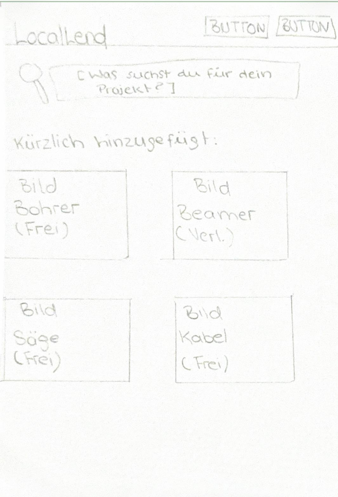
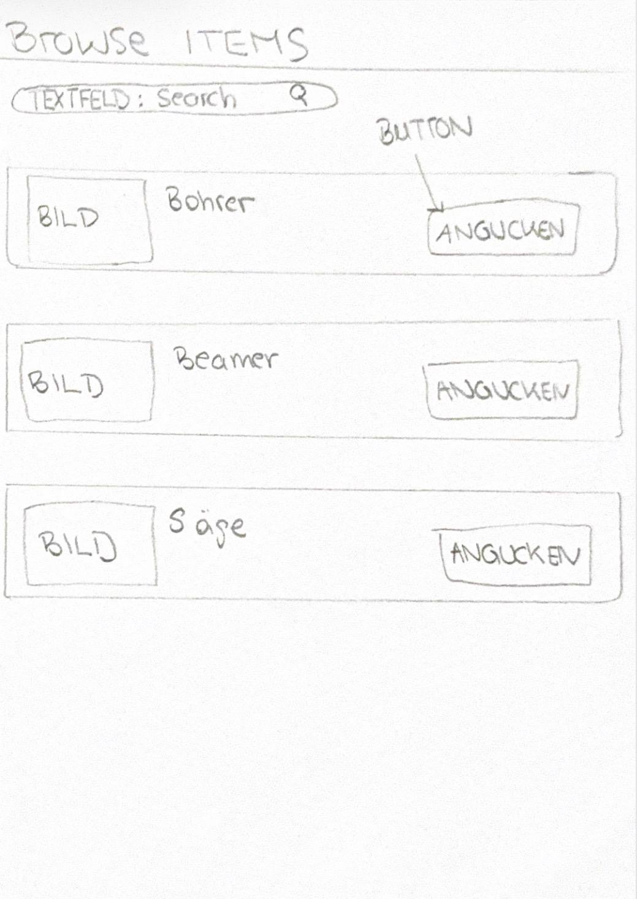
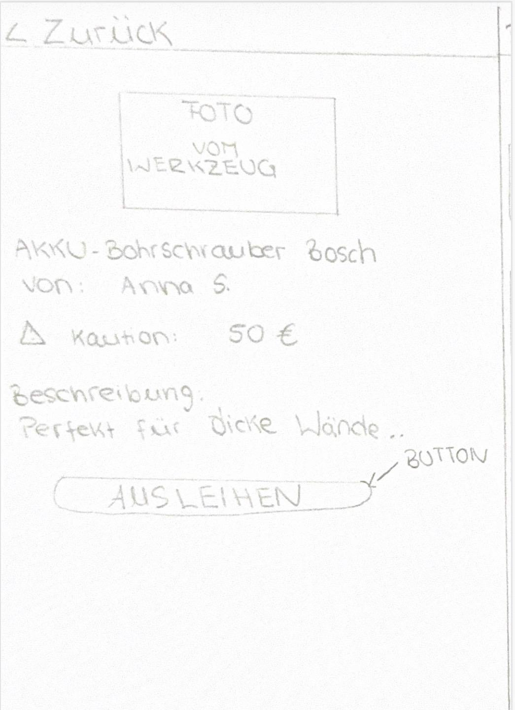
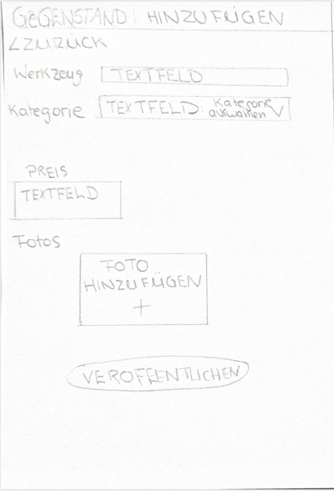
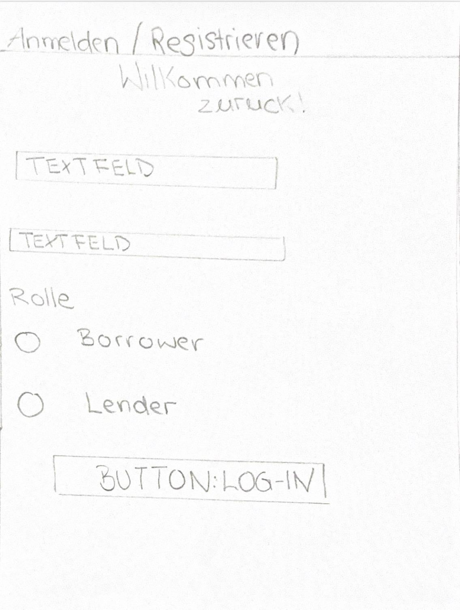
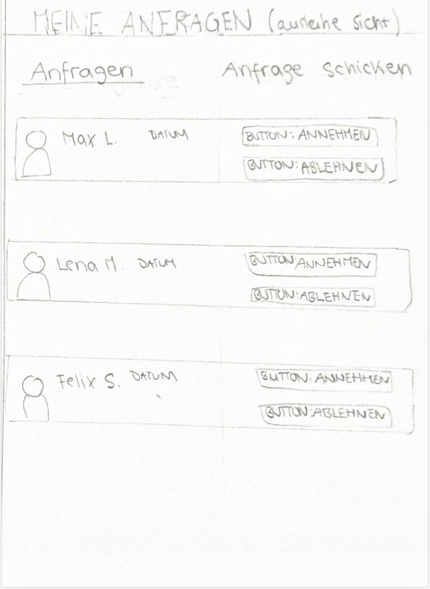

# Locallend_Gruppe-5

## 1. Team Composition
*   **Team Name:** Group 5 - LocalLend
*   **Repository Access:** Unser GitHub-Repository ist auf "public" gestellt und die Dokumentation ist über GitHub Pages erreichbar.
*   **Contributors & Meta-Goals**
    *   **Tuba Celik (Matrikelnummer: 77206594559)**
        *   *Target Grade:* 1.7
        *   *Personal Goal:* Das Flask-Routing richtig verstehen und das Backend für die Ausleih-Funktion eigenständig zum Laufen bringen.
    *   **Jean Yves Nkwane (Matrikelnummer: 77201393552)**
        *   *Target Grade:* 1.7
        *   *Personal Goal:* Ein sauberes Frontend mit HTML und Bootstrap bauen, komplett ohne verbotene JavaScript-Hacks.
    *   **Wendy Sharonia Lontsi Doumtsop (Matrikelnummer: 77209106458)**
        *   *Target Grade:* 1.7
        *   *Personal Goal:* Die SQLite-Datenbank logisch aufsetzen und sicherstellen, dass sie reibungslos mit Flask interagiert.
    *   **Maryam Joumma (Matrikelnummer: 77207472992)**
        *   *Target Grade:* 1.7
        *   *Personal Goal:* Den Git-Workflow strukturieren und dafür sorgen, dass unsere Pull Requests im Team ohne Konflikte funktionieren.

## 2. Value Proposition
Unsere App "LocalLend" ist eine klassische zweiseitige Plattform (Two-Sided Platform) für Tool-Sharing auf dem Campus und in der Nachbarschaft.

*   **Target User & Problem:** Wir richten uns primär an Studierende und Anwohner. Das Problem: Für einmalige Projekte (z.B. Umzug, kleine Reparaturen) werden teure Werkzeuge benötigt (z.B. Schlagbohrmaschine). Ein Neukauf ist für Studierende zu teuer (Pain). Andere besitzen diese Dinge, lassen sie aber meist ungenutzt liegen, weil sie Angst haben, sie an Fremde zu verleihen und sie beschädigt zurückzubekommen (Pain).
*   **App-based Solution:** Wir bauen eine Web-App, die das lokale Ausleihen und Verleihen sicher und übersichtlich organisiert.
*   **Die zwei Seiten der Plattform**:
    *   *Seite A (Die Verleiher):* Stellen ihre ungenutzten Werkzeuge ein. Als "Pain Reliever" gegen die Angst vor Beschädigung kann bei jedem Tool transparent eine verpflichtende Kaution hinterlegt werden, die Sicherheit schafft.
    *   *Seite B (Die Leiher):* Suchen gezielt nach Werkzeugen, können diese unkompliziert anfragen und sparen sich das Geld für einen Neukauf (Gain Creator).

## 3. Target Scope (Visual Scoping)

Um den Umfang unserer App visuell darzustellen, haben wir die wichtigsten Screens als Scribbles entworfen.

---

### Scribble 1: Landing Page (Startseite)
Die Startseite bietet eine Suchleiste sowie eine Übersicht über verfügbare Gegenstände.  
Nutzer erhalten hier einen schnellen Einstieg und sehen direkt, was aktuell ausgeliehen werden kann.

  

### Scribble 2: Browse Items
Auf dieser Seite können Nutzer alle Gegenstände durchsuchen.  
Jeder Eintrag enthält ein Bild, einen Titel und einen Button zur Detailansicht.

  

### Scribble 3: Detailansicht
Hier werden alle Informationen zu einem Gegenstand angezeigt (Beschreibung, Besitzer, Kaution).  
Über den „Ausleihen“-Button kann eine Anfrage gestartet werden.

  

### Scribble 4: Gegenstand erstellen
Verleiher können hier neue Gegenstände hinzufügen.  
Das Formular enthält Titel, Kategorie, Preis/Kaution und ein Bild.

  

### Scribble 5: Login / Registrierung
Nutzer können sich anmelden oder registrieren und dabei ihre Rolle wählen (Borrower oder Lender).  
Die Rolle bestimmt die verfügbaren Funktionen in der App.

  

### Scribble 6: Anfragen verwalten
Verleiher sehen hier eingehende Anfragen und können diese annehmen oder ablehnen.  
Damit wird entschieden, ob ein Gegenstand ausgeliehen wird.

  

## Happy Path (User Flow)

1. Ein Nutzer registriert sich und wählt die Rolle „Verleiher“.  
2. Der Verleiher loggt sich ein und erstellt einen neuen Gegenstand.  
3. Ein zweiter Nutzer registriert sich als „Leihender“ und loggt sich ein.  
4. Der Leihende durchsucht die verfügbaren Gegenstände auf der Plattform.  
5. Der Leihende öffnet die Detailansicht eines Gegenstands und stellt eine Anfrage.  
6. Der Verleiher sieht die eingehende Anfrage in seinem Dashboard.  
7. Der Verleiher akzeptiert die Anfrage.  
8. Der Status des Gegenstands ändert sich von „verfügbar“ zu „ausgeliehen“.  
9. Nach der Nutzung markiert der Leihende den Gegenstand als „zurückgegeben“.  
10. Der Status des Gegenstands wird wieder auf „verfügbar“ gesetzt.

Dieser Ablauf bildet die zentrale Interaktion zwischen Verleihern und Leihenden ab und zeigt die vollständige Kernlogik der Plattform.

## 4. AI Directory (Generative AI Use Policy)
Wir dokumentieren hier transparent unseren Einsatz von KI-Tools gemäß den Richtlinien des Moduls:
*   **Tool:** Gemini (Chat-Interface).
*   **Art der Nutzung:** Wir haben die KI als interaktiven Sparringspartner genutzt, um die Pains und Pain Relievers unserer Value Proposition sauber zu definieren und die Markdown-Struktur für diese README zu generieren.
*   **Erklärung:** Wir übernehmen die volle Verantwortung für alle formulierten Inhalte. Wir haben streng darauf geachtet, **keine** Agentic AI (wie Copilot Agents, Aider etc.) einzusetzen, die autonom Dateien verändert, Code generiert oder Commits erstellt.
